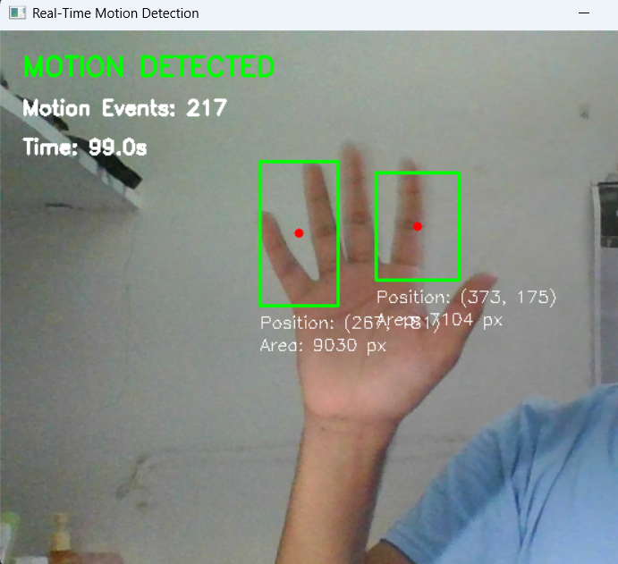
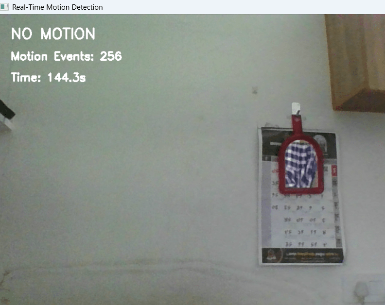
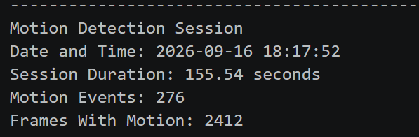

# Real-Time Motion Detection & Activity Monitoring System

**Name:** Vedant Sunil Patil  
**Registration Number:** 24BAI10122  
**Course:** Computer Vision

## 1. Project Overview

This project is a real-time motion detection system made using Computer Vision.

The system uses a webcam to capture live video and compares consecutive frames to detect movement. When motion is detected, the moving region is shown using a bounding box.

The system also displays the position and area of the detected region, counts motion events and saves session details in a log file.

The project uses classical Computer Vision techniques with Python and OpenCV. No AI or Machine Learning model is used.

## 2. Features

- Real-time motion detection using a webcam
- Grayscale conversion
- Gaussian blur for basic noise reduction
- Frame differencing
- Thresholding
- Contour-based motion detection
- Bounding box around detected motion
- Merging of nearby motion regions
- Center coordinate display
- Motion area display
- Motion event counting
- Session time display
- Activity logging

## 3. Technologies and Tools Used

- Python 3
- OpenCV
- NumPy
- Visual Studio Code
- Git and GitHub
- Laptop/PC webcam

## 4. Computer Vision Concepts Used

### Grayscale Conversion

The camera frame is converted into grayscale before further processing.

### Gaussian Blur

Gaussian blur is used to reduce small image noise.

### Frame Differencing

The current frame is compared with the previous frame to find changes caused by movement.

### Thresholding

Thresholding helps separate significant changes from smaller changes in the frame.

### Contour Detection

Contours are used to find the regions where motion has been detected.

### Bounding Boxes

Bounding boxes are drawn around detected motion regions so that the movement can be seen clearly.

## 5. How the Project Works

The basic workflow of the system is:

```text
Webcam
   ↓
Frame Capture
   ↓
Grayscale Conversion
   ↓
Gaussian Blur
   ↓
Frame Difference
   ↓
Thresholding
   ↓
Contour Detection
   ↓
Motion Region Detection
   ↓
Bounding Box and Information Display
   ↓
Activity Analysis
   ↓
Session Logging
```

## 6. Functional Modules

### Camera Module

Captures frames from the webcam.

**Input:** Live webcam  
**Output:** Video frames

### Preprocessing Module

Converts the frame to grayscale and applies Gaussian blur.

**Input:** Camera frame  
**Output:** Preprocessed frame

### Motion Detection Module

Compares consecutive frames and detects motion regions.

**Input:** Preprocessed frames  
**Output:** Motion contours

### Activity Analysis Module

Keeps track of motion events and frames containing motion.

**Input:** Detected motion regions  
**Output:** Motion status and statistics

### Visualization Module

Displays bounding boxes, coordinates, area, status and session time.

**Input:** Camera frame and detection results  
**Output:** Annotated video

### Logging Module

Saves the session information after the program ends.

**Input:** Session statistics  
**Output:** Activity log file

## 7. Input and Output

### Input

The main input of the project is a live video stream from the webcam.

### Output

The system displays:

- Motion status
- Bounding box
- Center coordinates
- Motion area
- Number of motion events
- Session duration

The session information is also saved in `activity_log.txt`.

## 8. Project Structure

```text
MotionDetectionProject/
│
├── screenshots/
│   ├── activity_log.png
│   ├── motion_detected.png
│   └── no_motion.png
│
├── activity_analyzer.py
├── activity_log.txt
├── camera.py
├── config.py
├── logger.py
├── main.py
├── motion_detector.py
├── preprocessing.py
├── README.md
└── requirements.txt
```

## 9. File Description

| File | Purpose |
|------|---------|
| `main.py` | Runs the complete application |
| `camera.py` | Handles webcam operations |
| `config.py` | Stores camera and motion settings |
| `preprocessing.py` | Prepares frames for detection |
| `motion_detector.py` | Detects motion |
| `activity_analyzer.py` | Analyzes motion and counts events |
| `logger.py` | Saves session information |
| `activity_log.txt` | Stores activity records |
| `requirements.txt` | Contains required packages |
| `README.md` | Project documentation |

## 10. Installation

Make sure Python is installed on the computer.

Open the project folder in the terminal and run:

```bash
pip install -r requirements.txt
```

The required packages are:

```text
opencv-python==4.11.0.86
numpy==1.26.4
```

## 11. How to Run

Open the project folder in Visual Studio Code.

Run:

```bash
python main.py
```

The webcam window will open.

Move your hand or another object in front of the camera to test the system.

Press `Q` to close the program.

After the session ends, the activity information is saved in:

```text
activity_log.txt
```

## 12. Testing

The project can be tested using the following cases:

| Test Case | Expected Result |
|-----------|-----------------|
| Start the program with a working webcam | Camera window opens |
| Keep the scene still | `NO MOTION` is displayed |
| Move a hand or object | `MOTION DETECTED` is displayed |
| Move nearby regions | Nearby regions are merged for clearer display |
| Camera cannot be opened | Error message is displayed |
| Press `Q` | Program closes |
| End a session | Session information is saved in the log file |

## 13. Non-Functional Requirements

### Performance

The system should process the webcam feed with minimum unnecessary delay.

### Usability

The system should be simple to operate using a webcam and a basic display window.

### Reliability

The system checks whether the camera can be opened and whether a frame has been captured successfully.

### Resource Efficiency

The project uses lightweight Computer Vision operations and does not require AI/ML model training.

### Maintainability

The project is divided into separate modules, with each module handling a specific responsibility.

### Logging

Session information is stored in `activity_log.txt`.

## 14. Limitations

- The system detects movement but does not identify the object.
- A stationary object is eventually not treated as motion.
- Sudden lighting changes may sometimes be detected as motion.
- The project uses one webcam input.

## 15. Future Enhancements

Possible future improvements include:

- Motion video recording
- More detailed activity reports
- Adjustable motion sensitivity
- Region-of-interest based detection
- Support for multiple cameras

## 16. Screenshots

The following screenshots show the working output of the project.

### Motion Detected



### No Motion



### Activity Log



## 17. Conclusion

This project demonstrates the use of Computer Vision techniques for real-time motion detection.

The system captures webcam frames, processes them, compares consecutive frames and displays detected motion regions.

The modular structure keeps the project simple, lightweight and easy to understand.
